**# 🕵️ aSYMMETRICK Writeup**

## 🗺️ Navigation
- [📦 The Loot Stash (Challenges Files)](#-the-loot-stash-challenges-files)
- [🔍 Peeking Without Touching (Basic Static Analysis)](#-peeking-without-touching-basic-static-analysis)
- [⚙️ Poking It With a Stick (Basic Dynamic Analysis)](#-poking-it-with-a-stick-basic-dynamic-analysis)
- [🧩 Code Archaeology (Advanced Static Analysis)](#-code-archaeology-advanced-static-analysis)
- [🧠 Mind-Meld With the Machine (Advanced Dynamic Analysis)](#-mind-meld-with-the-machine-advanced-dynamic-analysis)
- [🛠️ Breaking & Remaking (Cracking the Code)](#%EF%B8%8F-breaking--remaking-cracking-the-code)
- [💰 Claiming the Bounty (Profit)](#-claiming-the-bounty-profit)

---

## 📦 The Loot Stash (Challenges Files)
> All the challenge files, goodies, and digital treasure.

After recieving the challenge files we are presented with a .7z archive and a password.txt file.
Opening the archive with the supplied password gives us a .exe file name under the name **aSYMMETRICK.exe**
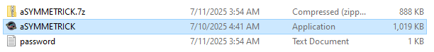

I downloaded the file initially on my kali box before transporting it to my windows box so you will see me switch between my kali and windows box throughout the right up since my windows box essentially just has ida on it.

---

## 🔍 Peeking Without Touching (Basic Static Analysis)
> Looking at the target without running it.

First thing I like to do when getting a file is trying to determine what we are dealing with.

Runing the file command is usually where I start. 

Command: ```file aSYMMETRICK.exe```
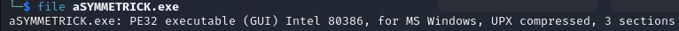

Alright a few good things to notice here one its a PE32 gui executable and seemingly UPX Packed but let's try running it through Detect-It-Easy to make sure.
Command: ``` die aSYMMETRICK.exe ```

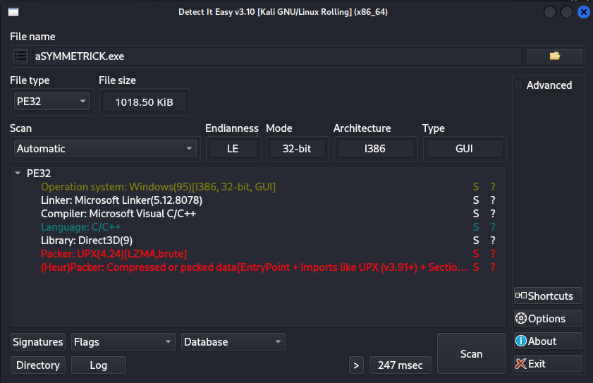

Looks like the file is indeed packed using UPX v4.24 lets go ahead and unpack it using the upx program.
Conveniently this can be done with a simple command.

Command: ```upx -d .\aSYMMETRICK.exe -o unpacked.exe```

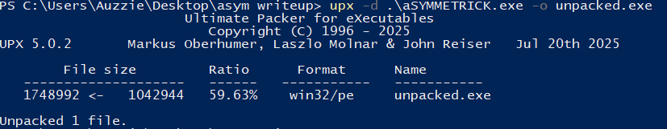

***Note: UPX is a very common program that can pack and unpack binaries.***

Last thing to check for this section that was relevant to the challenge is running strings to see if we can find anything interesting.

Command: ``` strings ./unpacked.exe ```

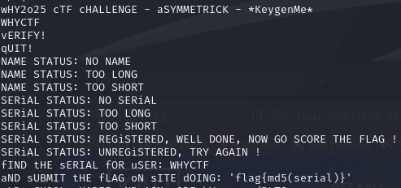

There was a tone of output but a few interesting strings did turn up that might help us out later.
1. **wHY2o25 cTF cHALLENGE - aSYMMETRICK - \*KeygenMe\*** 
    a.We now can expect this challenge to be some sort of key verification tool as per the name KeyGenMe.
2. **fIND tHE sERIAL fOR uSER: WHYCTF aND sUBMIT tHE fLAG oN sITE dOING: 'flag{md5(serial)}'**
    a. We now know that if we crack the key verification for the user WHYCTF and pass it to md5 we will have gotten the flag.

Some other strings in the screenshot are going to prove useful but I dont think they need any explaining.


---

## ⚙️ Poking It With a Stick (Basic Dynamic Analysis)
> Cautiously running and observing the target.

I have everything running in a VM so my next step was to just run the .exe file and see what happens.


We are presented with a window popup with the logo for WHYCTF25 and some nice music.
Other than that there isnt much that happens. I tried clicking around in the popup but nothing really happens. Lets move to ida and see whats going on here.

---

## 🧩 Code Archaeology (Advanced Static Analysis)
> Digging deep into the source, disassembly, and buried logic.


Starting with our main function we can see some interesting things happening right off the bat.

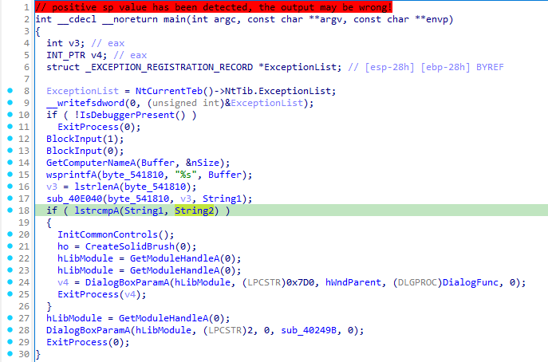
1. On line 10 we can the program checks to see if a debugger is attached and if there is the program calls ExitProcess(0);
    a. Not to worry we can either patch this to flip execution flow (I guess they dont want us pocking around lol)
2.  Lines 14-18 seem to be using GetComputerNameA to get the name of the machine its running on and comparing it to a string. 
    a. I just went ahead and patched this as well so it would return true for everything but the correct name.
    b. Inside the if statement we are taken to the real program which I will show in the next section. If strcmp statement evaluates as false we are shown the popup window with music as seen in the last section.


---

## 🧠 Mind-Meld With the Machine (Advanced Dynamic Analysis)
> Interacting with the binary’s brain in real time.

At last after patching the file as discussed in the last section we are presented with a much more interesting GUI Application.
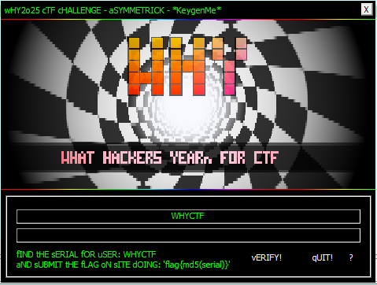

We are given two text boxes. One that is prefiled out for us which we are gonna assume is the username box and other which we are gonna assume is where we will enter the key.

We are also given three buttons. One used to verify the username and key, one to exit the program and lastly an informationly button that isn't really important.

I started by just spamming the input box with A's to see what would happen.


Looks like it does give us some useful information. I guess the key is going to a certain length lets fill it up with A's and see if we can get any different output.
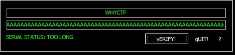

Alright now we know that our key needs to be of an exact length since not enough characters tells us 'too short' and too many characters tells us 'too long'.

If we look around in ida we can find where this check is happening
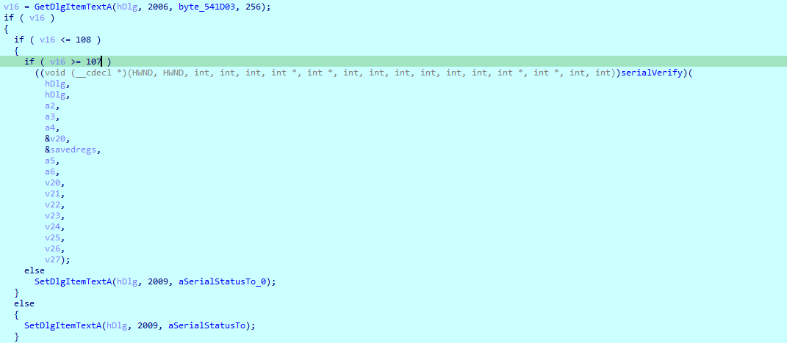
1. v16 is set to contents of the serial key text box and the length is then checked at these if statements. As you can see the key needs to be exactly at length 107 in order for the later stages of verification to happen.
    a. I simply used python to create me a quick string of 107 A's

Command: ```python -c "print('A' * 107)"```

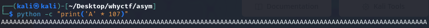

Lets plug this into the program and see if we get anything different.
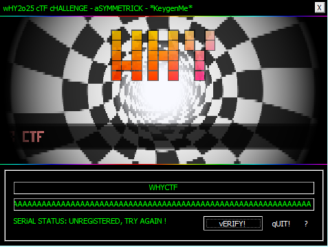

Well I found out the correct key length but now comes the hard part. In the next section I'll show you how to crack the serial key.

---

## 🛠️ Breaking & Remaking (Cracking the Code)
> Patching, cracking, and bending the code to your will.

To keep the length of this writeup down I'm going to move through the rest of the process rather quickly.

Our serial key verification function can be seen in the picture below.
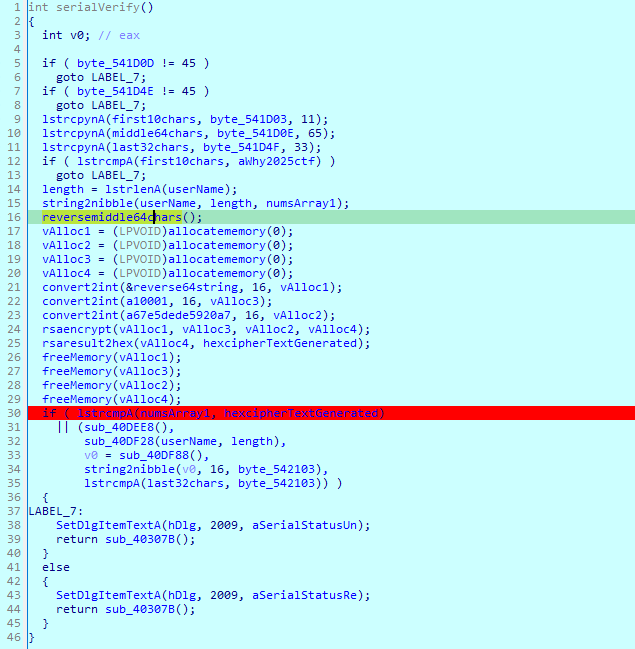
1. On lines 5 and 7 it is checking if the serial key we entered has a '-' at two seperate positions if not it will jump to LABEL 7 which is the unregistered display prompt we saw before.
    a. The 11th character in the string needs to be a '-'
    b. The 76th character in the string needs to be a '-'
2. On lines 9-11 our input serial key is copied into 3 seperate memory locations each taking a certain amount of characters
    a. On line 9 it takes the first 10 characters
    b. On line 10 it takes the middle 64 characters
    c. On line 11 it takes the last 32 characters 
3. On line 12 it validates the first 10 characters of our input string with a constant string within the program
    a. If we go and look at the memory location by clicking on the string we can view the contents.
    b. If the first part of the string does not contain the desired string the serial key is invalid.
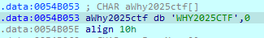
4. Great we are off to a good start our input string should look something like this at this point
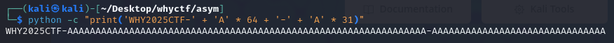
Command: ```python -c "print('WHY2025CTF-' + 'A' * 64 + '-' + 'A' * 31)"```
5. On lines 14-15 we see an interesting function.
    a. On line 14 it first gets the length of a string which holds the username inputed in the first text box of the program. 
    b. On line 15 the function takes 3 arguments the first is the username string, the second is the length of the string and the last is an array in which the operation performed in this function will be stored. This function takes each ascii character in the user name converts it to its hex value and then splits it into 2 nibbles taking the 4 high bits and 4 low bits and storing them into an array. So our name has 6 characters and the result of this function stores 12 characters since 6 * 2 = 12
    c. This value will be used later on line 30
6. On line 16 its a simple function that converts the byte order of characters stored in the middle64chars array.
7. On lines 17-20 4 sections of memory are created using VirtualAlloc.
8. On lines 21-23 3 strings are converted into a number with base 16.
9. On line 24 after some analysis I finally realized that rsa modular exponentiation was happening 
    a. vAlloc1 holds the plaintext message (m) as an integer in base 16
    b. vAlloc3 holds (e) as a integer in base 16; e = 0x10001
    c. vAlloc2 holds (n) as a integer in base 16; n = "67E5DEDE5920A73E8B2EDCA1BE39DEF75351102BBF3D314E8AAE8BC594B70D61"
    d. vAlloc4 will hold the generated ciphertext message (c) as a integer in base16

###### 🔐 RSA: Encryption & Decryption
In RSA, encryption and decryption are basically:

<div style="text-align: left;margin-left: 20px">

\( c \equiv m^e \pmod{n} \quad \text{(encryption)} \)  
\( m \equiv c^d \pmod{n} \quad \text{(decryption)} \)

</div>

Where:
- **\( m \)** = message (as a number)
- **\( c \)** = ciphertext
- **\( e \)** = public exponent
- **\( d \)** = private exponent
- **\( n \)** = modulus

In our program we are given e,n and c and we provide the program with m as the middle64character section of the serial key.
In order for us to reverse the ciphertext we are going to have to compute d after finding the factors for n. Lucky for us this program uses a 256bit modulus value which isn't to hard to crack. 
We can use a program called msieve in order to do this.

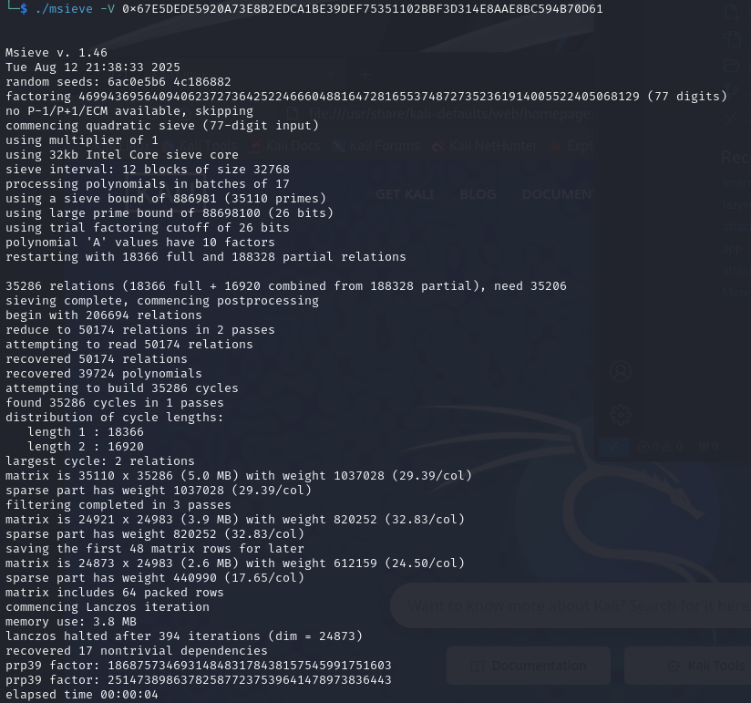
**Note: we are given 2 factors p = '186875734693148483178438157545991751603' and q = '251473898637825877237539641478973836443'**

Now that we have the 2 factors of n we can compute d.
<div style="text-align: left;margin-left: 20px">

\( \varphi(n) = (p-1)(q-1) \)

Requirement: \( \gcd(e,\;\varphi(n)) = 1 \).  

\( d \equiv e^{-1} \pmod{\varphi(n)} \)\.  

</div>

    d = 8340914395983065039896090730630261986787813284378279487958178280268828540097


Command: ```./msieve -V 0x67E5DEDE5920A73E8B2EDCA1BE39DEF75351102BBF3D314E8AAE8BC594B70D61```

10. On line 25 the result stored in vAlloc4 is then converted into a hex string and stored into the variable hexcipherTextGenerated
11. On lines 26-29 all 4 memory locations designated as vAlloc(n) are freed since they are no longer needed in the rest of the program.
    a. This is done to reduce memory leaks.
12. On line 30 we have a if statement that will perform the check on wether the generated cipher text held in hexCipherTextGenerated matches the desired cipher text held in numsArray1.
If the values does match the desired cipherText held in numsArray1 it then does a check to ensure the last 32 characters in the string match the value held at byte_542103.
The final two checks are easier to visualize when seen in ida's graph view.
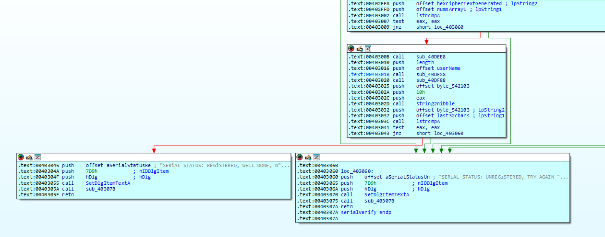


13. In order to crack the on the middle 64 characters of your string we need to reverse the desired ciphertext held in numsArray1 by doing the following steps. I will provide a python script that does this automatically in the next section.
    1. Convert the hex nibbles that are stored in numsArray1 into a single hex string
    2. We then convert that hex value into a integer
    3. We then use d,n that in order to convert the ciphertext int into a plaintext int 
    4. Convert the plaintext int into a its hex equavilant well call the hex plaintext
    5. Reverse the order of the hex plaintext
    6. Lastly, replace the middle 64 characters with the hex plaintext that we reversed.
14. Now in order to pass the final check I just set a breakpoint at the last strcmp on line 35 and then looked at the memory location at byte_542103 and then replaced the end of my serial key with that value.
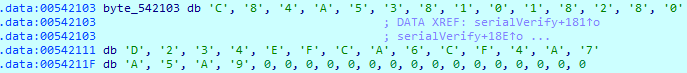
**Note: byte_542103 = 'C84A5381018280D234EFCA6CF4A7A5A9'**


Alright I understand that was a lot but I'm gonna hopefully wrap this up and things will be clear.
1. First check is to make sure the first 10 characters in our serial key is 'WHY2025CTF'
2. The next character in the serial key should be a '-'
3. The next 64 characters are going to be the hex plaintext we acquired from reversing the ciphertext explained in step 13
4. The next character in the string should be a '-'
5. The last 32 characters in the serial key is going to be the value stored in byte_542103.

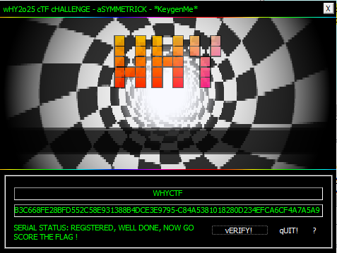


---

## 💰 Claiming the Bounty (Profit)
> Victory dance, final notes, and lessons learned.

Serial Key = WHY2025CTF-D3B50E8A5D621A7BC22AFDB74F1B3C668FE28BFD552C58E931388B4DCE3E9795-C84A5381018280D234EFCA6CF4A7A5A9

The final flag can be computed like by getting the md5 hash of the serial key and then putting it into flag format 

**flag{md5(Serial Key Goes Here)}**

Solution Python Script

```python 
from sympy import mod_inverse

p = 186875734693148483178438157545991751603
q = 251473898637825877237539641478973836443
n = p * q

e = 65537
phi = (p - 1) * (q - 1)
d = mod_inverse(e, phi)

numsArray1_nibbles = ['5', '7', '4', '8', '5', '9', '4', '3', '5', '4', '4', '6']

def hex_nibbles_to_int(hex_nibbles_str):
    ciphertext_hex = ''.join(hex_nibbles_str)
    return int(ciphertext_hex, 16)

def int_to_bytes(n, length):
    return n.to_bytes(length, byteorder='big')

def rsa_decrypt(ciphertext_int, d, n):
    return pow(ciphertext_int, d, n)

def find_middle64chars_from_ciphertext(numsArray1_nibbles, d, n, key_byte_length):
    ciphertext_int = hex_nibbles_to_int(numsArray1_nibbles)
    print(ciphertext_int)
    plaintext_int = rsa_decrypt(ciphertext_int, d, n)
    print(plaintext_int)
    middle64chars = hex(plaintext_int)[2:][::-1].upper()
    return middle64chars

key_byte_length = (n.bit_length() + 7) // 8
middle64chars = find_middle64chars_from_ciphertext(numsArray1_nibbles, d, n, key_byte_length)

print("Original middle 64 chars hex string:", middle64chars)

first10 = 'WHY2025CTF'
seperator = '-'
last32 = 'C84A5381018280D234EFCA6CF4A7A5A9'

key = first10 + seperator + middle64chars + seperator + last32

print('Serial Key = ' + key)


```
