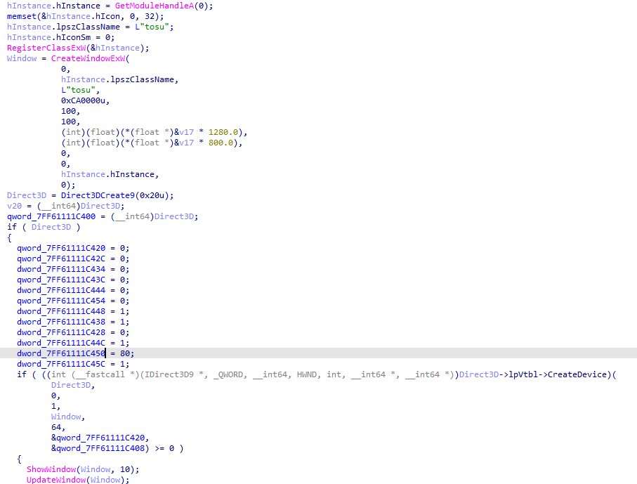

# CTF Writeup: TOSU1.exe

## Challenge Overview
- **Category:** REV
- **Points:** 500
- **Description:** Welcome to the first part of the series of tosu challenges. Full clear the attached map scoring only 300s.

---
## Initial Analysis

When running the program with the provided chal1.map file this is what we see.

<video controls src="ezgif-651b1a46897bac.mp4" title="Title"></video>

**The goal of the game is to click all of circles and create the perfect score to get the flag. At least thats what you would think.**

---
## Reverse Engineering
### Binary Analysis

Dropping into main in IDA we can see that it takes in a .map file as an argument. This file was provided with the tosu.exe program.

Once the .map file has been parsed into the program it moves on to creating a new window and a creates a Direct3D9 Object.

Moving further into main we have a our core gameplay loop. There a ton of functions here but theres really only one function that is worth mentioning since it handles the calculations that determine the internal game state. We can find under LABEL 44: in ida as sub_7FF6110858D0.

Within what I called the internal game loop function you will find 2 calls to a function that does some hashing.

This first call for this function you can find when the game determines that missed the target.

The second call for this function you can find when the game determines that you hit the target.

Within this function it checks to see if the 3rd parameter passed to it is equal to either 1,2,3 or 4.
Depending on the value of the 3rd parameter it then sets the value for v6 and calls the hashing function sub_7FF611083D50. 

---
## Exploit / Solution Development

In order to beat the game we need to manipulate the 3rd parameter passed to sub_7FF6110858D0 when we miss the circle in order to trick the game into thinking we hit the target but the rest of the parameters to the function need to be aligned to as if we missed the target.

1 = 50 points
2 = 100 points
3 = 300 points 
4 = missed

So in order to get "max points and full clear" we would need to pass 3 instead of 4 as the third parameter to sub_7FF6110858D0.

We can simply do this by patching a single byte in the program.

Before:

After: 

Now we can simply run the game and we will get the flag. 

